<div align="center">
  
</div>
<p align="center">
  
</p>

<p align="center">
  <a href="https://github.com/Mukilan-s18">
    
  </a>
  <a href="https://www.linkedin.com/in/mukilan-s2486">
    
  </a>
  <a href="mailto:mukilans25361@gmail.com">
    
  </a>
  
  
</p>

---

## 🧠 About Me


```python
class Mukilan:
    def __init__(self):
        self.name         = "Mukilan S"
        self.location     = "Chennai, Tamil Nadu 🇮🇳"
        self.degree       = "B.Tech – AI & ML @ REC, Chennai (2028)"
        self.email        = "mukilans25361@gmail.com"
        self.public_repos = 19

        self.stack = [
            "Python", "TypeScript", "Java", "C",
            "React", "Next.js", "FastAPI", "Vite",
            "PyTorch", "TensorFlow", "Keras",
            "Scikit-Learn", "XGBoost", "Gradio",
            "LangGraph", "RAG", "Gemini",
            "Firebase", "Supabase", "Docker"
        ]

        self.currently_learning = [
            "Transformers & Vision Models",
            "LLM Fine-Tuning & RAG Pipelines",
            "MLOps & Model Deployment",
            "Agentic AI – LangGraph & Gemini",
            "Azure AI Services"
        ]

        self.fun_fact = "Predicted both 2022 WC finalists with my ML model! ⚽"

    def motto(self):
        return "Build. Learn. Deploy. Repeat. 🚀"
```

<br clear="right"/>

---

## 🛠️ Tech Stack & Tools

### 💻 Languages


### 🤖 AI / ML Frameworks & Libraries


### 🤖 Agentic AI & GenAI


### 🌐 Frameworks & Frontend


### ☁️ Cloud & DevOps


### 🗄️ Databases & Data Sources


### 🔧 Tools


---

## 📊 GitHub Stats

<div align="center">
  
  &nbsp;
  
</div>

---

## 🔥 Streak Stats

<div align="center">
  
</div>

---

## 📈 Activity Graph

<div align="center">
  
</div>

---

## 🏆 Trophy Wall
<div align="center">
  
</div>

---

## 💼 Featured Work Experience

<details open>
<summary><b>🤖 Internship in Generative AI — Altruisty Innovation Pvt Ltd | February 2026</b></summary>

> `Generative AI` `LLMs` `AI Workflows`

- 🚀 Completed an intensive 15-day internship focused on **Generative AI** technologies.
- 🧠 Gained hands-on experience and deep insights into the rapidly evolving field of GenAI and large language models.

</details>

<details>
<summary><b>🔧 PumpDiagnosisChallenge — Computer Vision Engineer | June 2026</b></summary>

> `Python` `PyTorch` `ResNet18` `Transfer Learning` `STFT` `Computer Vision` `Predictive Maintenance`

- 🏗️ Built a pump fault diagnosis system on the **MANGO Platform** using Transfer Learning with **ResNet18** on STFT Spectrogram images.
- 🔬 Converted raw vibration signals into **frequency-domain spectrograms** and trained a fine-tuned CNN for multi-class fault classification.
- 🚀 Applied **Transfer Learning** to achieve high accuracy on limited industrial sensor data.

</details>

<details>
<summary><b>🔍 Defect-Detection — Anomaly Detection Engineer | June 2026</b></summary>

> `Python` `PyTorch` `PatchCore` `WideResNet50` `Unsupervised Learning` `Computer Vision`

- 🏗️ Implemented a state-of-the-art **anomaly detection system** for industrial manufacturing using **PatchCore** algorithm with **WideResNet50** backbone.
- 🎯 Achieved near-perfect detection without any defective training samples using **unsupervised learning**.
- 🔬 Extracted deep feature embeddings and built a coreset memory bank for efficient nearest-neighbor anomaly scoring.

</details>

<details>
<summary><b>🚨 StampedeZero — Edge AI Platform | July 2026</b></summary>

> `Python` `PyTorch` `YOLOv8` `FastAPI` `React` `Computer Vision` `Edge AI`

- 🧠 Architected a **real-time crowd safety platform** using YOLOv8 for crowd density estimation and early stampede detection.
- 📡 Built a **FastAPI + React** dashboard with live video feed processing and alert systems.
- ⚡ Optimized for **edge AI deployment** with low-latency inference for real-time surveillance scenarios.

</details>

<details>
<summary><b>🌿 Ecosphere Management Platform — Full-Stack Developer | July 2026</b></summary>

> `TypeScript` `Next.js` `React` `Supabase` `ESG` `Gamification` `Sustainability`

- 🌍 Built a comprehensive **ESG (Environmental, Social, Governance) platform** to monitor sustainability metrics and ensure compliance.
- 🎮 Implemented a **gamification engine** to incentivize employee green initiatives with points and leaderboards.
- 📊 Designed beautiful data visualizations and reporting dashboards for ESG insights.
- 🔗 **Live**: [ecosphere-management-platform.vercel.app](https://ecosphere-management-platform.vercel.app)

</details>

<details>
<summary><b>🧠 Industrial-Operations-Brain — Agentic AI Engineer | June 2026</b></summary>

> `Python` `LangGraph` `Gemini` `RAG` `Knowledge Graph` `FastAPI` `Next.js` `IoT`

- 🤖 Architected an **Agentic AI system** fusing RAG + Knowledge Graph + Live IoT data for industrial knowledge intelligence.
- 🔗 Used **LangGraph** for multi-agent orchestration and **Google Gemini** as the core reasoning engine.
- 📡 Integrated real-time IoT sensor streams into the knowledge pipeline for adaptive industrial decision-making.

</details>

<details>
<summary><b>🤖 CompileAI — AI Pipeline Engineer | June 2026</b></summary>

> `Python` `FastAPI` `Next.js` `Pydantic` `OpenAI` `Code Generation`

- 🏗️ Engineered a **7-stage pipeline** that converts natural language product requirements into validated, executable application specifications (UI, API, DB, Auth).
- 🔗 **Live**: [compile-ai-rho.vercel.app](https://compile-ai-rho.vercel.app)

</details>

<details>
<summary><b>⚽ FIFA 2026 World Cup Predictive Analytics Engine — Project Lead | June 2026</b></summary>

> `Python` `Scikit-Learn` `XGBoost` `Random Forest` `Logistic Regression` `React` `Vite` `Firebase` `Monte Carlo`

- 🏗️ Architected a complete ML pipeline using Python & Scikit-Learn to predict World Cup match outcomes from historical data and team Elo ratings.
- 🎯 Trained ensemble models (Logistic Regression, Random Forest, XGBoost) and ran **10,000 Monte Carlo tournament simulations** to compute win probabilities.
- ✅ Validated model accuracy by correctly predicting both **2022 FIFA World Cup finalists** using historical data.
- 🌐 Built a React + Vite interactive web application and deployed globally via **Firebase Hosting** for zero-friction accessibility.

</details>

<details>
<summary><b>🌦️ AeroWeather — Frontend Developer | March 2026</b></summary>

> `React 18` `Vite` `GitHub Actions` `REST APIs` `Glassmorphic UI` `Responsive Design`

- 🚀 Engineered a high-performance weather dashboard using **React 18 + Vite**, integrating real-time weather and 7-day forecasting APIs.
- 📊 Built interactive radar maps and atmospheric analytics visualizations with a responsive **glassmorphic dark-mode UI**.
- ⚡ Boosted application load performance by **~40%** through Vite build optimizations and lazy-loading strategies.
- 🔄 Automated deployment pipelines with **GitHub Actions**, achieving 100% CI/CD coverage and eliminating manual release steps.

</details>

<details>
<summary><b>🔢 MNIST ANN Digit Classifier — Project Lead | December 2025</b></summary>

> `Python` `TensorFlow` `Keras` `Gradio` `GitHub Actions` `Pytest` `Ruff` `CI/CD`

- 🧠 Designed and trained ANN architectures with **Dropout and Early Stopping** regularization for MNIST handwritten digit classification.
- 🏆 Achieved **98.08% test accuracy** with an **F1-score of 0.98** across all 10 digit classes on 10,000 test images.
- 📐 Benchmarked against a CNN baseline achieving **99.07% accuracy**, producing a thorough comparative model analysis.
- 🔁 Established a full **CI/CD pipeline using GitHub Actions, Pytest, and Ruff** — 100% automated validation on every push.

</details>

---

## 🚀 Featured Projects

<div align="center">

| 🗂️ Project | 🛠️ Stack | ✨ Highlights & Metrics |
|:---|:---|:---|
| [🔧 PumpDiagnosisChallenge](https://github.com/Mukilan-s18/PumpDiagnosisChallenge) | Python · PyTorch · ResNet18 · STFT | Transfer learning on spectrograms · Predictive maintenance |
| [🔍 Defect-Detection](https://github.com/Mukilan-s18/Defect-Detection) | Python · PyTorch · PatchCore · WideResNet50 | Zero-shot anomaly detection · Unsupervised learning |
| [🚨 StampedeZero](https://github.com/Mukilan-s18/StampedeZero) | Python · YOLOv8 · FastAPI · React | Real-time crowd safety · Edge AI |
| [🌿 Ecosphere Platform](https://github.com/Mukilan-s18/Ecosphere-Management-Platform) | TypeScript · Next.js · Supabase | ESG monitoring · Gamification · [Live 🔗](https://ecosphere-management-platform.vercel.app) |
| [🧠 Industrial-Ops-Brain](https://github.com/Mukilan-s18/Industrial-Operations-Brain) | Python · LangGraph · Gemini · RAG | Agentic AI · Knowledge Graph · IoT fusion |
| [🤖 CompileAI](https://github.com/Mukilan-s18/CompileAI) | Python · FastAPI · Next.js · OpenAI | NL → App specs · 7-stage pipeline · [Live 🔗](https://compile-ai-rho.vercel.app) |
| [⚽ FIFA 2026 Predictor](https://github.com/Mukilan-s18/Mukilan-s18) | Python · Scikit-Learn · XGBoost · React · Firebase | 10,000 simulations · Predicted 2022 WC finalists |
| [🌦️ AeroWeather](https://github.com/Mukilan-s18/weather-app) | React 18 · Vite · REST APIs · GitHub Actions | ~40% faster load · Full CI/CD · [Live 🔗](https://mukilan-s18.github.io/weather-app/) |
| [🔢 MNIST Digit Classifier](https://github.com/Mukilan-s18/mnist-ann-classifier) | Python · TensorFlow · Keras · Gradio · Pytest | 98.08% accuracy · 0.98 F1-score · 100% CI/CD |

</div>

---

## 🎖️ Achievements & Certifications

<div align="center">

| 🏅 | Achievement | Details |
|:---:|:---|:---|
| 🏆 | **Winner - MANGO Platform AI/ML Workshop** | Organized by Walmart Center for Tech Excellence, IIT Madras (June 2026) |
| 🏅 | **Applied Machine Learning and AI** | CII, Centre for AI |
| 🏅 | **Machine Learning & Deep Learning Onramp** | MathWorks |
| 🏅 | **Data Analytics & Cyber Job Simulations** | Deloitte |
| 🤖 | **Microsoft Learn – AI & Gen AI Basics** | Certified by Microsoft Learn |
| 🪁 | **Microsoft Learn – Microsoft Copilot** | Get Started with Microsoft Copilot certification |
| 🗄️ | **LinkedIn Learning – Database Management** | Database Foundations: Database Management Certification |
| 🧠 | **End-to-End AI Projects** | Delivered 9+ production-grade AI/ML projects independently |
| 🔬 | **Industrial Computer Vision** | PatchCore & Transfer Learning for manufacturing defect detection |
| 🤖 | **Agentic AI Systems** | LangGraph + Gemini multi-agent RAG + IoT fusion system |
| ⚽ | **FIFA 2022 WC Prediction Validation** | Model correctly predicted both 2022 finalists from historical data |
| 🎯 | **MNIST 98.08% Accuracy** | ANN model achieving 0.98 F1-score across 10,000 test images |
| 🔥 | **40% Performance Improvement** | AeroWeather load time reduction via Vite optimization |

</div>

---

## 🎓 Education & Currently Learning

### 🏛️ Education

<div align="center">

| 🎓 Degree | 🏫 Institution | 📅 Year | 📊 Score |
|:---|:---|:---|:---|
| B.Tech – Artificial Intelligence & Machine Learning | Rajalakshmi Engineering College, Chennai | Expected 2028 | In Progress |

</div>

### 🧱 Currently Learning

```
🤖 Agentic AI      → LangGraph, Multi-Agent Systems, Tool Use, Gemini APIs
🧱 Generative AI   → LLM Fine-Tuning, Prompt Engineering, RAG Pipelines
🔬 Deep Learning   → Transformers, Attention Mechanisms, Vision Models
☁️  MLOps          → Model Serving, Docker, CI/CD for ML, Azure ML
📊 Advanced ML     → Ensemble Methods, Bayesian Optimization, AutoML
🌐 Full-Stack AI   → FastAPI, Next.js, WebSockets, Real-Time Inference
```

---

<div align="center">
  
</div>
<p align="center">
  <i>⭐ If you find my work interesting, consider giving a star to my repos!</i><br/>
  <b>Let's connect and build something amazing together 🚀</b>
</p>
